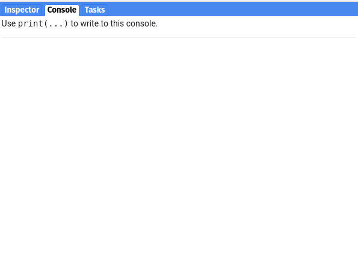

# should-test

[](https://developers.google.com/earth-engine/tutorials/tutorial_api_01)
[](https://code.earthengine.google.com/d5309955cc7d2e7c0ab0dee9bd156d30)


- ☑️ Write one-line unit tests in the [Google Earth Engine](https://earthengine.google.com/) code editor
- ⏱️ Evaluate client or server-side objects asynchronously

# Quickstart

First, import the `should:test` module into your script.

```javascript
var should = require("users/aazuspan/should:test");
```

Then write your first test.

```javascript
should.equal(ee.Number(42), 42, "Check numbers are equal");
```

Hit `run` and the test will evaluate and let you know if it passed ✅ or failed 🛑. Write more tests and `should-test` will run them and summarize the results, printing out any errors that occur.



# Usage

## Server and Client Objects

Tests in `should-test` work transparently with client- and server-side objects. For example, both of the following work:

```javascript
var year = 2022;
should.beGreater(year, 2010, "Check client-side year");
```

```javascript
var year = ee
  .Image("LANDSAT/LC09/C02/T1_L2/LC09_001006_20220404")
  .date()
  .get("year");
should.beGreater(year, 2010, "Check server-side year");
```

Tests with Earth Engine objects run asynchronously and report their results when finished, so there's no risk of freezing the browser with `getInfo`.

## Filtering Tests

By default, all the tests you've called will evaluate when you run your script. To filter tests that run, call `should.settings.skip` and/or `should.settings.run` at the top of your script. These functions match a regular expression pattern against the test descriptions and skip or run accordingly.

```javascript
should.settings.run("band");

should.contain(image.bandNames(), "SR_B4", "check for band"); // run
should.beLess(collection.size(), 100, "compare size"); // skipped
```

## Writing Complex Tests

In order to run each test, the `should` assertion needs to be called. For organization, you can combine the assertion and any setup steps needed into a function and call that function, like so:

```javascript
// Build the test
var myTest = function () {
  var l9 = ee.ImageCollection("LANDSAT/LC09/C02/T1_L2");
  var geom = ee.Geometry.Point([-112.690234375, 41.13290902574011]);
  var col = l9.filterBounds(geom);
  var cloudless = col.filter(ee.Filter.lt("CLOUD_COVER", 5));

  should.beGreater(cloudless.size(), 1, "check # of cloud-free images");
};

// Run the test
myTest();
```

For convenience, you can skip naming and calling your test function using `should.utils.call`, like so:

```javascript
// Build and run the test
should.utils.call(function () {
  var l9 = ee.ImageCollection("LANDSAT/LC09/C02/T1_L2");
  var geom = ee.Geometry.Point([-112.690234375, 41.13290902574011]);
  var col = l9.filterBounds(geom);
  var cloudless = col.filter(ee.Filter.lt("CLOUD_COVER", 5));

  should.beGreater(cloudless.size(), 1, "check # of cloud-free images");
});
```

## Testing Functions

There are two assertions that test whether a function throws an error: `should.throw` and `should.notThrow`. To use these, be sure to pass the callable function, not it's evaluated result. For example:

```javascript
var myFunction = function () {
  print("Hello world");
};

// Correct!
should.throw(myFunction);

// Incorrect! This will test the return value of the function instead of the function.
should.throw(myFunction());
```

If the function you want to test requires arguments, you can pass them using an anonymous function.

```javascript
var myFunction = function(message) { print(message) };

// Wrap your function in an anonymous function to pass arguments
should.notThrow(function() {
    myFunction("Hello world");
}
```

# API Reference

## Assertions

Assertions test a condition and fail when false. All assertions take a `description` that is used to log test results.

### Comparisons

To use a comparison assertion, Earth Engine objects must implement the corresponding operator, e.g. `eq`, `neq`, `gt`, etc.

- `should.beTrue(value, description)`: The `value` should be true (strict for JS objects).
- `should.beFalse(value, description)`: The `value` should be false (strict for JS objects).
- `should.equal(actual, expected, description)`: The `actual` should equal the expected.
- `should.notEqual(actual, expected, description)`: The `actual` should not equal the `expected`.
- `should.beGreater(value, other, description)`: The `value` should be greater than `other`.
- `should.beGreaterOrEqual(value, other, description)`: The `value` should be greater than or equal to `other`.
- `should.beLess(value, other, description)`: The `value` should be less than `other`.
- `should.beLessOrEqual(value, other, description)`: The `value` should be less than or equal to `other`.

### Other

- `should.match(string, pattern, description)`: The regex `pattern` should match the `string`. 
- `should.notMatch(string, pattern, description)`: The regex `pattern` should not match the `string`. 
- `should.contain(list, value, description)`: The `list` should contain the `value`.
- `should.notContain(list, value, description)` The `list` should not contain the `value`.

### Functions

- `should.throw(function, description)`: Calling `function` should throw an error.
- `should.notThrow(function, description)`: Calling `function` should not throw an error.

### Settings

- `should.settings.skip(pattern)`: Tests with descriptions that match the regex `pattern` are skipped.
- `should.settings.run(pattern)`: Only tests with descriptions that match the regex `pattern` are run.

### Utilities

- `should.utils.call(func)`: Call `func`. Handy for wrapping anonymous functions.
